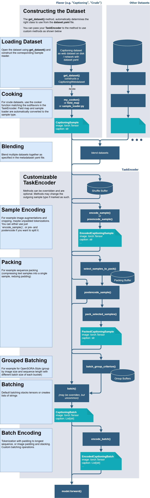

<!--- Copyright (c) 2025, NVIDIA CORPORATION.
SPDX-License-Identifier: BSD-3-Clause -->

# Data Flow

(flavors_general)=
## Dataset Flavors

The datasets are organized in "flavors", i.e. each modality returned by the dataset is a "flavor".
A modality can for example be a {py:class}`CaptioningSample <megatron.energon.CaptioningSample>` or an 
{py:class}`VQASample <megatron.energon.VQASample>`. The dataset class combines the source data format
and the iterated sample format. For example, the {py:class}`CaptioningWebdataset <megatron.energon.CaptioningWebdataset>` 
combines the webdataset loader with the {py:class}`CaptioningSample <megatron.energon.CaptioningSample>`.

For all types, see 
