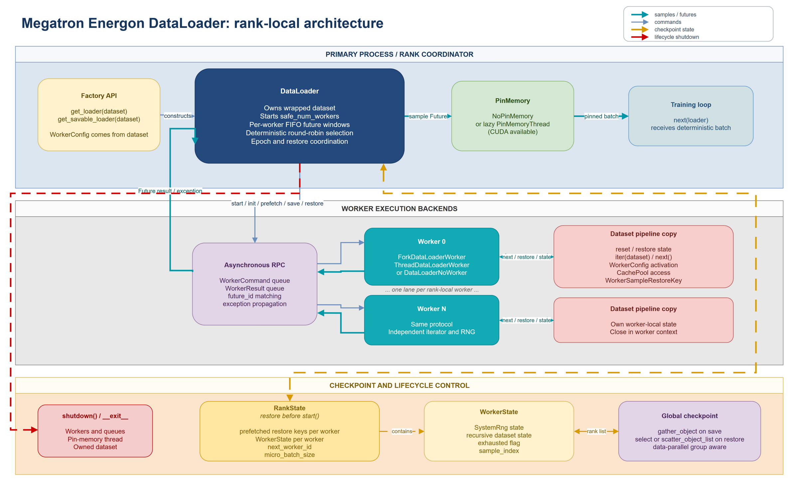
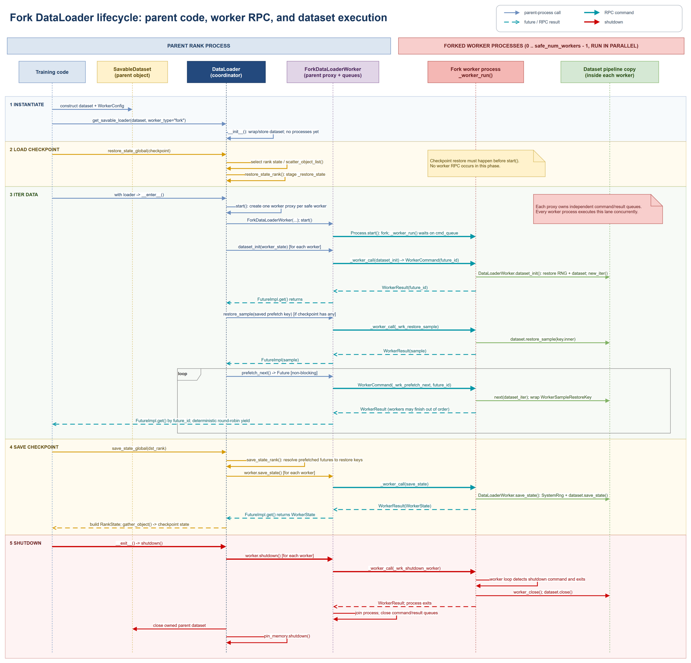
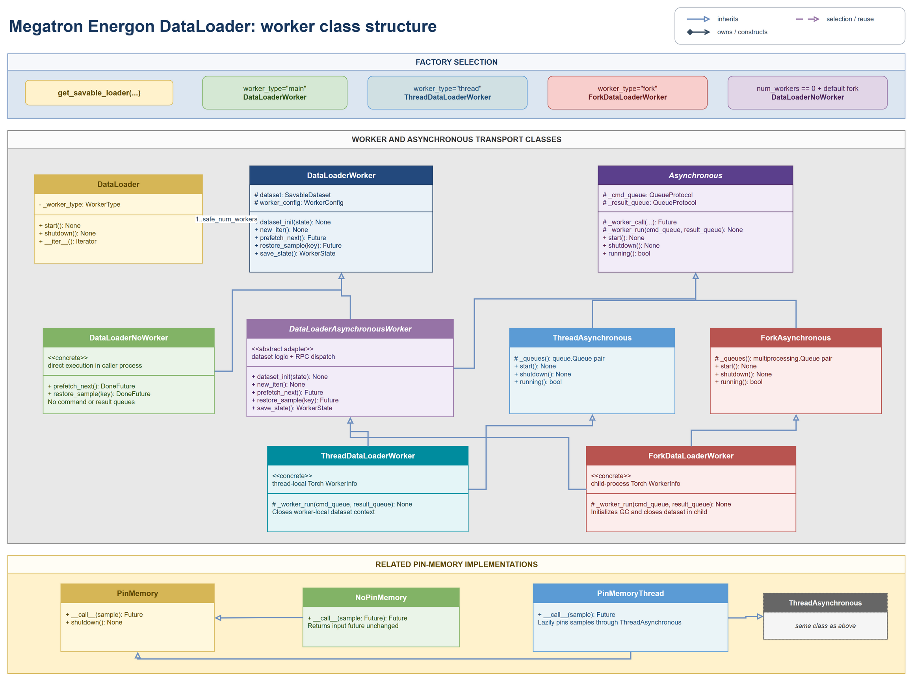

<!--- Copyright (c) 2025, NVIDIA CORPORATION.
SPDX-License-Identifier: BSD-3-Clause -->

# DataLoader Internals

This page describes the custom Megatron Energon `DataLoader` for developers working on worker
execution, deterministic checkpointing, prefetch, or lifecycle behavior. It describes the current
implementation in `src/megatron/energon/dataloader` and the factory functions in
`src/megatron/energon/loader.py`.



The editable source for the diagram is
{download}`dataloader.drawio <../images/dataloader.drawio>`.

## Responsibilities and Boundaries

One `DataLoader` coordinates one rank. Dataset sharding across ranks and workers is already encoded
in the dataset's `WorkerConfig`; the loader does not repartition samples itself. Its responsibilities
are:

- select and start the worker backend;
- maintain a bounded prefetch window for every rank-local worker;
- interleave workers deterministically;
- optionally pin returned samples in the primary process;
- capture worker state plus already-prefetched samples;
- route restore keys back to the worker that produced them; and
- shut down workers, queues, helper threads, and the owned dataset.

The loader takes ownership of its dataset. A dataset passed to a loader must not be shared with
another live loader.

## Construction

`get_loader()` and `get_savable_loader()` both construct the custom `DataLoader`. The latter exposes
additional worker-backend, garbage-collection, cache-pool, pin-memory, and compatibility options.

The factory derives the effective execution mode from `WorkerConfig.num_workers`:

| Configuration | Worker implementation | Execution location |
| --- | --- | --- |
| `num_workers == 0` | `DataLoaderNoWorker` | Calling process |
| `worker_type="fork"` | `ForkDataLoaderWorker` | One forked process per worker |
| `worker_type="thread"` | `ThreadDataLoaderWorker` | One thread per worker |
| `worker_type="main"` | `DataLoaderWorker` | Calling process |

The loader wraps the dataset with `WatchdogDataset` and `GcDataset` when those features are enabled.
For worker-backed loaders, automatic pinning creates a lazy `PinMemoryThread` when CUDA is available.
The pinning thread starts only when its first future is submitted.

## Lifecycle

Construction does not start workers. Workers start in either of two ways:

1. `DataLoader.__enter__()` calls `start()` immediately.
2. Iteration calls `start()` lazily when the first epoch iterator runs.

`start()` creates `safe_num_workers` worker objects, starts their execution backend, and calls
`dataset_init()` in each worker. A pending restore state is applied during this initialization.

Use the loader as a context manager whenever possible:

```python
with get_loader(dataset) as loader:
    for batch in loader:
        train_step(batch)
```

For checkpoint restore, state must be installed before entering the context because entering starts
the workers:

```python
loader = get_savable_loader(dataset)
loader.restore_state_rank(state)

with loader:
    for batch in loader:
        train_step(batch)
```

`shutdown()` stops every worker, closes process or thread queues, shuts down the pin-memory helper,
and closes the owned dataset. It is idempotent for an already-stopped loader. `__del__()` is only an
emergency fallback: it emits a warning and may have to terminate process workers instead of shutting
them down cooperatively.

### Fork Lifecycle Call Flow



The editable source for the flow diagram is
{download}`dataloader_fork_flow.drawio <../images/dataloader_fork_flow.drawio>`.

The worker-process lifeline represents each rank-local fork worker; those processes execute in
parallel with independent command and result queues. Solid teal messages are commands submitted by
`_worker_call()`, while dashed teal messages are `WorkerResult` values matched to `FutureImpl`
instances by `future_id`. The flow also highlights that checkpoint state is staged before workers
start, then applied through RPC when `start()` initializes each worker and reconstructs saved
prefetched samples.

## Steady-State Iteration

The rank coordinator keeps one FIFO list of sample futures per worker. At the start of an epoch it
fills every list to `prefetch_factor`. It then repeats the following sequence:

1. Select `_next_worker_id` and advance it round-robin.
2. Skip workers already marked exhausted.
3. Pop the oldest future for the selected worker.
4. Submit another `prefetch_next()` command to refill that worker's window.
5. Resolve the popped future, waiting only if its result is not ready.
6. Yield the sample and update rank-local debug counters.

This gives deterministic worker interleaving even when worker completion times differ. Results may
arrive out of order on asynchronous result queues; `FutureImpl` matches each result by `future_id`
and stores results for other pending futures while waiting for the requested one.

When every worker returns `StopIteration`, the epoch ends. The next epoch calls `new_iter()` on all
workers, clears the exhausted flags, and resets round-robin selection to worker 0.

## Worker Execution

`DataLoaderWorker` contains the backend-independent dataset logic:

- initialize or restore the dataset and RNG;
- create the dataset iterator;
- fetch the next sample;
- wrap its restore key with `WorkerSampleRestoreKey`; and
- save `WorkerState`.

### Implementation Classes



The editable source for the class diagram is
{download}`dataloader_classes.drawio <../images/dataloader_classes.drawio>`.

The asynchronous implementations use multiple inheritance. `DataLoaderAsynchronousWorker`
combines the dataset-facing `DataLoaderWorker` API with the `Asynchronous` command/future
mechanism. `ThreadDataLoaderWorker` then adds `ThreadAsynchronous`, while
`ForkDataLoaderWorker` adds `ForkAsynchronous`. The direct path uses the base worker operations in
the caller process; the default fork configuration is replaced by `DataLoaderNoWorker` when
`num_workers` is zero.

The related pin-memory hierarchy follows the same pattern. `NoPinMemory` returns the input future
unchanged,
while `PinMemoryThread` combines `PinMemory` with `ThreadAsynchronous` and starts its helper thread
lazily on the first sample.

`DataLoaderAsynchronousWorker` adapts those operations to commands and futures. Each command contains
a method name, arguments, and a `future_id`. The worker loop executes the method and returns either a
result or an exception tagged with the same ID.

The process backend uses `torch.multiprocessing.Queue`, installs worker signal handlers, limits Torch
to one thread in each child, and monitors the parent process. The thread backend uses `queue.Queue`
and thread-local Torch worker information. Both expose the same worker protocol to the coordinator.

## Checkpoint State

`save_state_rank()` captures all information needed to continue the same rank-local stream:

- restore keys for samples already inside each prefetch window;
- one `WorkerState` per worker;
- the next worker selected by round-robin interleaving; and
- the inferred micro-batch size.

Each `WorkerState` contains the worker RNG state, recursive dataset state, exhaustion flag, and next
sample index. Prefetched samples are represented by restore keys rather than serialized sample data.

`restore_state_rank()` only records the state. Actual restoration happens later in `start()`:

1. Worker dataset and RNG states are restored through `dataset_init()`.
2. Prefetched samples are reconstructed from their restore keys.
3. Round-robin and exhaustion metadata are restored.
4. The pending restore state is cleared.

If the restored loader uses a smaller compatible micro-batch size, the loader splits
`BatchRestoreKey` instances while preserving their wrapper structure. Increasing the micro-batch
size or using an incompatible size is rejected.

`save_state_global()` gathers rank states through the configured data-parallel group.
`restore_state_global()` either selects the local entry from a state list or scatters entries from a
designated source rank before delegating to `restore_state_rank()`.

## Sample Restore Keys

Every yielded sample is wrapped in `WorkerSampleRestoreKey`, which records the global worker ID and
worker-local sample index around the dataset's own restore key. `restore_sample()` maps that global
worker ID back to a rank-local worker and executes the underlying dataset restore operation in the
correct worker context.

Restore keys are part of the deterministic data-stream contract. Changes to wrapper nesting, worker
mapping, batching, or sample-key semantics require compatibility tests for both checkpoint restore
and direct sample restore.

## Change Checklist

When modifying the loader, verify at least the following:

- the same seed and configuration produce the same yielded order;
- checkpoint restore reproduces both consumed and prefetched samples;
- interrupted iteration continues the existing epoch iterator;
- all worker backends propagate results and exceptions identically;
- `num_workers == 0` remains a supported non-process path;
- smaller compatible micro-batches restore through batch-key splitting;
- context exit and explicit `shutdown()` leave no workers or helper threads alive; and
- no loader is started before `restore_state_rank()` or `restore_state_global()` is called.
